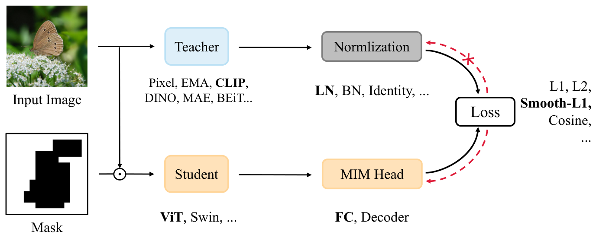

# Masked Distillation Pretraining

PyTorch reimplementation of MaskDistill from ["A Unified View of Masked Image Modeling"](https://arxiv.org/abs/2210.10615). This repo provides many different masked distillation pretraining configurations explored in the original work.


<p align="center">

</p>

## Requirements
- Python 3.8+
- `pip install -r requirements`

## Usage
To pretrain a ViT-b/16 network following MaskDistil's default configuration run:
```
python train.py --accelerator gpu --devices 1 --precision 16  --data.root path/to/data
--max_epochs 300 --data.batch_size 256 --model.student_model vit_base_patch16 
--model.teacher_model clip_vit_large_patch14 --model.head_model fc --model.lr 2.5e-4
--data.mask_ratio 0.4
```
- Run `python train.py --help` for descriptions of all options.
- `--model.student_name` can be one of: 
    - `vit_tiny_patch16`, `vit_small_patch16`, `vit_base_patch16`, `vit_large_patch16`, `vit_huge_patch14`
    - `swin_tiny_patch4`, `swin_small_patch4`, `swin_base_patch4`, `swin_large_patch4`

- `--model.teacher_name` can be one of:
    - `clip_vit_base_patch32`, `clip_vit_base_patch16`, `clip_vit_large_patch14`
    - `openclip_vit_base_patch32`, `openclip_vit_large_patch14`, `openclip_vit_giant_patch14`, `openclip_vit_huge_patch14`
    - `pixel` (predict masked patches' pixel values)

- `--model.head` can be one of `fc`, `vit`.

### Using a Pretrained Model
Student weights can be extracted from a pretraining checkpoint file by running:
```
python scripts/extract_student_weights.py -c path/to/checkpoint/file
```
You can then initialize a ViT model with these weights with the following:
```python
import torch
from timm.models.vision_transformer import VisionTransformer

weights = torch.load("path/to/weights/file")

# Assuming weights are for a ViT-b/16 model
model = VisionTransformer(
    patch_size=16,
    embed_dim=768,
    depth=12,
    num_heads=12,
)
model.load_state_dict(weights)
```
- __Note__: `VisionTransformer` arguments should match the those used during pretraining (e.g. ViT-b/16, ViT-l/16, etc.).

If you want to keep the pretrained relative position embeddings and/or the Layer Scale gamma parameters you can run:

```
python scripts/extract_student_weights.py -c path/to/checkpoint/file --keep_rel_pos_bias 
--keep_layer_scale_gamma 
```

To load the relative position embeddings you will need to initialize a BEiT model with the following:

```python
import torch
from timm.models.beit import Beit

weights = torch.load("path/to/weights/file")

model = Beit(
    patch_size=16,
    embed_dim=768,
    depth=12,
    num_heads=12,
    use_rel_pos_bias=True,
    init_values=0.1,
)
model.load_state_dict(weights)
```

## Citation
```bibtex
@article{peng2022unified,
  title={A unified view of masked image modeling},
  author={Peng, Zhiliang and Dong, Li and Bao, Hangbo and Ye, Qixiang and Wei, Furu},
  journal={arXiv preprint arXiv:2210.10615},
  year={2022}
}
```
